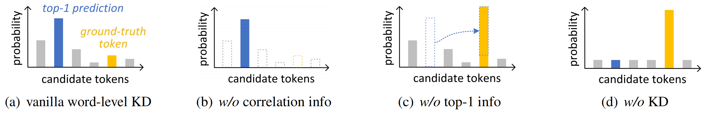

# NMT-KD
Code for ACL2023 paper "Towards Understanding and Improving Knowledge Distillation for Neural Machine Translation". [[paper]([arxiv.org/pdf/2305.08096.pdf](https://arxiv.org/pdf/2305.08096.pdf))]

## Requirements
- python version == 3.7.0
- fairseq version == 0.12.2
- pytorch version == 1.13.1
- sacrebleu version == 1.5.1
- admin-torch version == 0.1.0

## Analysis Experiments (Take WMT14 En-De as an example)
### Step 0: Train a teacher model (Transformer-big, 300k steps)
```shell
bash train_ende_big_teacher.sh
```
### Step 1: Removing information from word-level KD 


#### (a) Vanilla word-level KD
```shell
bash train_ende_vanilla_word_kd.sh
```
#### (b) Removing the correlation information
```shell
bash train_ende_word_kd_wo_corr.sh
```
#### (c) Removing the top-1 information
```shell
bash train_ende_word_kd_wo_top1.sh
```
#### (d) Student baseline (no KD)
```shell
bash train_ende_student_baseline.sh
```
### Step 2: Expand top-1 to top-k information
```shell
bash train_ende_word_kd_topk_info.sh
```
## Method: Top-1 Information Enhanced KD (TIE-KD)
```shell
bash train_ende_tie_kd.sh
```

## Evaluation
### Model Averaging
We use model averaging trick for the evaluation of all the student models (average last 5 checkpoints):
```shell
bash average_ckpts.sh
```
### Generation
Then we use fairseq-interactive to generate translations with the averaged model:
```shell
bash interactive_ende.sh
```
We use `multi-bleu.perl` in [mosesdecoder](https://github.com/moses-smt/mosesdecoder) to calculate the tokenized BLEU scores of the translations. Besides, we also use [COMET](https://github.com/Unbabel/COMET) ([`Unbabel/wmt20-comet-da`](https://huggingface.co/Unbabel/wmt20-comet-da)) for more comprehensive evaluation

## Citation

Please cite this paper if you use this repo.

```
@article{zhang2023towards,
  title={Towards Understanding and Improving Knowledge Distillation for Neural Machine Translation},
  author={Zhang, Songming and Liang, Yunlong and Wang, Shuaibo and Han, Wenjuan and Liu, Jian and Xu, Jinan and Chen, Yufeng},
  journal={arXiv preprint arXiv:2305.08096},
  year={2023}
}
```

